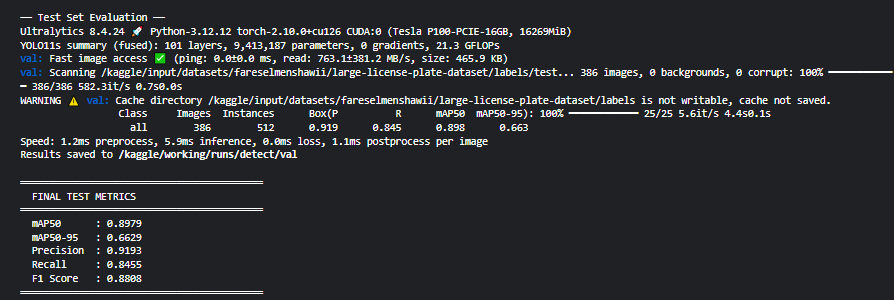
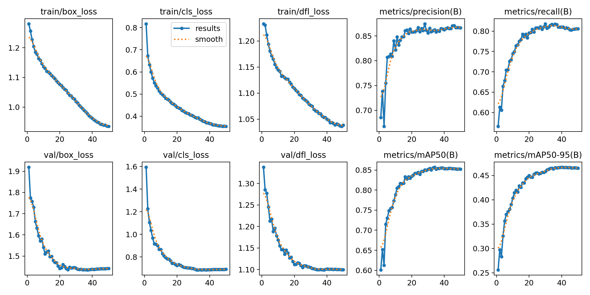
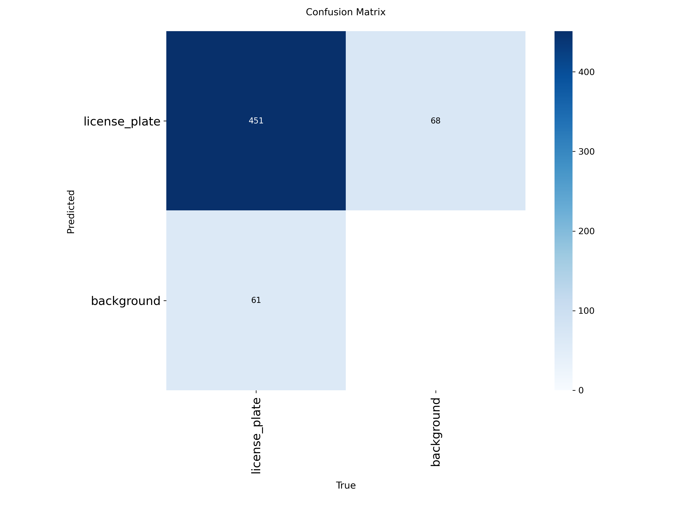

# Real-time Number Plate Detection by YOLO11s

A real-time vehicle license plate detection and recognition system built with **YOLO11s**,
deployed using **OpenCV** with **Tesseract OCR** for plate text recognition,
and stabilized using **ByteTrack** multi-frame tracking.

---

## Author
**Mokshan** — [@mokshan-123](https://github.com/mokshan-123)

---

## Project Overview

This project implements a complete end-to-end pipeline for real-time number plate detection
and OCR text reading:

1. **Detection** — YOLO11s detects and localizes the license plate in each frame
2. **Tracking** — ByteTrack assigns consistent IDs across frames for stability
3. **OCR** — Tesseract reads the plate text from the cropped detection region
4. **Display** — OpenCV renders bounding boxes and recognized text in real time

---

## Why YOLO11s?

YOLO11s was chosen after careful consideration of the speed-accuracy tradeoff
for a real-time deployment scenario.

| Model | Parameters | GFLOPs | mAP50 (COCO) | Use case |
|---|---|---|---|---|
| YOLO11n | ~2.6M | ~6 | lower | ultra-fast, low accuracy |
| **YOLO11s** | **~9.4M** | **~21** | **competitive** | **best balance ✓** |
| YOLO11m | ~20M | ~68 | higher | slower, high accuracy |
| YOLO11l | ~25M | ~87 | highest | not real-time friendly |

**Reasons for choosing YOLO11s:**

- **Speed** — 21 GFLOPs means fast inference even on modest hardware
- **Accuracy** — sufficient capacity to learn a single-class detection task (license plates)
- **Transfer learning** — pretrained COCO weights give a strong starting point, reducing training time
- **Real-time suitability** — achieves 100+ FPS on GPU (P100) and 8–15 FPS on CPU
- **Memory efficiency** — ~9.4M parameters fits comfortably in 16GB P100 at batch size 16
- **Single class advantage** — with only one class to detect (license_plate), a smaller
  model like YOLO11s is more than sufficient — larger models would overfit or waste compute

> YOLO11n was ruled out due to lower detection quality on small plates.
> YOLO11m and above were ruled out due to inference speed requirements for real-time use.

---

## Why Tesseract OCR instead of EasyOCR?

| Feature | EasyOCR | Tesseract |
|---|---|---|
| Type | Deep learning (LSTM + CNN) | Classical image processing |
| CPU inference speed | ~0.5s per plate | ~0.05s per plate |
| GPU required | Recommended | No |
| Accuracy | Very high | Good for clean plate crops |
| Install size | ~500MB model download | ~50MB |
| Real-time suitability | Poor on CPU | Excellent |

**Reasons for choosing Tesseract:**

- **10x faster on CPU** — EasyOCR takes ~0.5 seconds per plate on CPU, making real-time
  detection impossible. Tesseract takes ~0.05 seconds — fast enough to run every 6th frame
  without causing any visible lag
- **No GPU required for OCR** — the system already uses GPU for YOLO detection during
  training. For local deployment on older hardware, adding a GPU-dependent OCR model
  creates a bottleneck
- **Plate-optimized config** — Tesseract's `--psm 8` mode (single word) combined with
  a character whitelist (`A-Z 0-9`) is specifically suited for license plate format,
  reducing false reads significantly
- **Lightweight** — no large model download required, works immediately after install
- **Practical for older hardware** — this project was developed and tested on older
  CPU-only hardware where EasyOCR caused severe stuttering. Tesseract kept the pipeline
  smooth and usable

> EasyOCR would be the better choice if GPU inference is available locally.
> For CPU-only real-time deployment, Tesseract is the correct engineering decision.

---

## Repository Structure
```
Real-time-number-plate-detection-by-YOLO/
│
├── Annotated_Batch_images/     ← sample images with predicted bounding boxes
├── Code_and_YAML_Files/        ← training notebook and dataset YAML config
├── Evaluation_curves/          ← training curves, confusion matrix, PR curves
├── Final_weights/              ← best.pt and last.pt trained model weights
├── Real_time_detection/        ← detect.py for real-time webcam detection
├── Main_code_keggle            ← full Kaggle training notebook
├── LICENSE
└── README.md
```

---

## Dataset

- **Source:** [Large License Plate Detection Dataset](https://www.kaggle.com/datasets/fareselmenshawii/large-license-plate-dataset)
- **Total images:** ~27,000
- **Class:** `license_plate` (single class, class_id = 0)
- **Label format:** YOLO `.txt` — `class_id x_center y_center width height` (normalized)
- **Split:** Pre-split into train / val / test

| Split | Images | Boxes | Backgrounds |
|---|---|---|---|
| Train | 25,470 | 28,220 | 18 |
| Val | 1,073 | 1,573 | 0 |
| Test | 512 | 512 | 0 |

> 18 background images (empty labels) in the train split are intentional hard negatives —
> they teach the model to avoid false detections in scenes with no plates.

---

## Training Configuration

| Parameter | Value | Justification |
|---|---|---|
| Model | YOLO11s | best speed/accuracy balance for real-time use |
| Pretrained weights | COCO (`yolo11s.pt`) | transfer learning — faster convergence |
| Epochs | 50 | sufficient for single-class task |
| Image size | 640 | standard baseline for plate detection |
| Batch size | 16 | optimal for P100 16GB at imgsz=640 |
| Optimizer | AdamW | better convergence than SGD for fine-tuning |
| Learning rate | 0.001 | standard starting LR for AdamW |
| LR schedule | Cosine annealing | smooth decay, avoids abrupt LR drops |
| Warmup epochs | 3 | prevents loss spike in early batches |
| Weight decay | 0.0005 | L2 regularization to reduce overfitting |
| Early stopping | patience=15 | stops if mAP50 doesn't improve for 15 epochs |
| GPU | Tesla P100-PCIE-16GB (Kaggle) | free GPU via Kaggle notebooks |

### Augmentation Strategy

Since the dataset is large (~25,000 training images), heavy augmentation was avoided.
Only light augmentation was applied to simulate real-world variation:

| Parameter | Value | Reason |
|---|---|---|
| hsv_h | 0.015 | simulate different lighting tints |
| hsv_s | 0.3 | simulate faded or dirty plates |
| hsv_v | 0.3 | simulate shadows and brightness variation |
| degrees | 0.0 | disabled — plates are always horizontal |
| translate | 0.1 | handle plates near frame edges |
| scale | 0.3 | handle plates at different distances |
| flipud | 0.0 | disabled — no upside-down plates in real life |
| fliplr | 0.5 | plates appear on cars facing both directions |
| mosaic | 0.0 | disabled — large dataset doesn't need it |
| mixup | 0.0 | disabled — ghosted plates make no physical sense |

---

## Training Progress

| Epoch | mAP50 | Precision | Recall |
|---|---|---|---|
| 1 | 0.601 | 0.686 | 0.566 |
| 7 | 0.754 | 0.813 | 0.705 |
| 16 | 0.861 | 0.861 | 0.793 |
| 37 | 0.854 | 0.861 | 0.817 |
| Final (test) | **0.8979** | **0.9193** | **0.8455** |

---
## Final Results
<!-- Replace filename with your actual file from Evaluation_curves/ -->


---

## Training Curves

<!-- Replace filename with your actual file from Evaluation_curves/ -->


---

## Confusion Matrix for Test data set

<!-- Replace filename with your actual file from Evaluation_curves/ -->


---


## Sample Annotated Predictions

<!-- Replace filename with your actual file from Annotated_Batch_images/ -->


---

## Final Test Metrics

| Metric | Score | Meaning |
|---|---|---|
| mAP50 | **0.8979** | finds 90% of plates with ≥50% box overlap |
| mAP50-95 | **0.6629** | tight precise boxes across all IoU thresholds |
| Precision | **0.9193** | 92% of detections are real plates |
| Recall | **0.8455** | finds 85% of all real plates in the scene |
| F1 Score | **0.8808** | overall balance between precision and recall |

---

## Demo Video

<!-- Upload demo video or link to YouTube/Google Drive -->
> [Click here to watch the real-time detection demo](YOUR_VIDEO_LINK_HERE)

---

## How to Run Locally

### 1. Clone the repo
```bash
git clone https://github.com/mokshan-123/Real-time-number-plate-detection-by-YOLO.git
cd Real-time-number-plate-detection-by-YOLO
```

### 2. Install Python dependencies
```bash
pip install ultralytics opencv-python pytesseract torch torchvision lapx "numpy<2.0"
```

### 3. Install Tesseract OCR engine
Download and install from:
https://github.com/UB-Mannheim/tesseract/wiki

Default install path on Windows:
```
C:\Program Files\Tesseract-OCR\
```

### 4. Update the model path in detect.py
```python
model = YOLO("path/to/Final_weights/best.pt")
```

### 5. Find your camera index
```python
import cv2
for i in range(5):
    cap = cv2.VideoCapture(i)
    if cap.isOpened():
        print(f"Camera found at index {i}")
        cap.release()
```

### 6. Run real-time detection
```bash
cd Real_time_detection
python detect.py
```

Press **Q** to quit.

---

## Real-time Detection Pipeline
```
Webcam frame
      ↓
YOLO11s detects plate → bounding box (every 3rd frame)
      ↓
Crop plate region from frame
      ↓
Preprocess: grayscale → upscale 2x → Otsu threshold
      ↓
Tesseract OCR reads plate text (every 6th frame)
      ↓
Draw green box + orange OCR text on frame
      ↓
Display via OpenCV window
```

| Setting | Value | Reason |
|---|---|---|
| YOLO inference | every 3rd frame | reduces CPU load |
| OCR inference | every 6th frame | fast enough with Tesseract |
| Image size (inference) | 256 | faster on CPU than 640 |
| Confidence threshold | 0.4 | good balance of precision/recall |
| Camera resolution | 320×240 | reduces input data for speed |
| Tesseract PSM mode | 8 (single word) | optimized for plate format |
| Character whitelist | A-Z, 0-9 | ignores symbols and noise |

---

## Full Requirements
```
ultralytics>=8.0
opencv-python>=4.8
pytesseract>=0.3
torch>=2.0
torchvision
numpy<2.0
lapx
```

---

## License

This project is licensed under the MIT License —
see the [LICENSE](LICENSE) file for details.

---

## Acknowledgements

- [Ultralytics YOLO11](https://github.com/ultralytics/ultralytics)
- [Large License Plate Dataset — Fares Elmenshawi](https://www.kaggle.com/datasets/fareselmenshawii/large-license-plate-dataset)
- [Tesseract OCR](https://github.com/tesseract-ocr/tesseract)
- [Kaggle](https://www.kaggle.com) — free Tesla P100 GPU for training
- [ByteTrack](https://github.com/ifzhang/ByteTrack) — multi-object tracking
